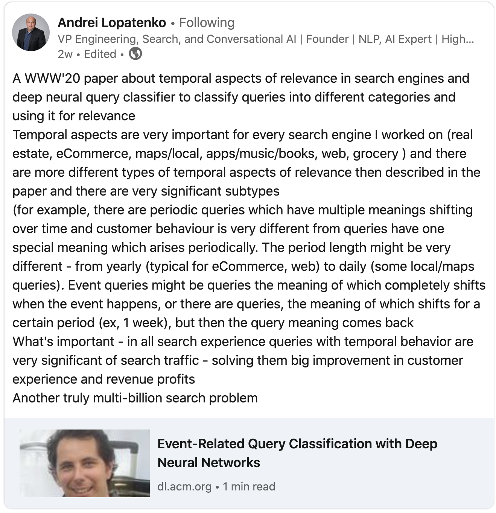

- [Event-Related Query Classification with Deep Neural Networks](https://dl.acm.org/doi/abs/10.1145/3366424.3382183)

- [Semantic Product Search for Matching Structured Product Catalogs in E-Commerce](https://arxiv.org/pdf/2008.08180.pdf)

- [Semantic Product Search](https://arxiv.org/pdf/1907.00937.pdf)

- [Named Entity Recognition for E-Commerce Search Queries](https://sdm-dsre.github.io/pdf/named_entity.pdf)

- [Expansion via Prediction of Importance with Contextualization](https://arxiv.org/pdf/2004.14245.pdf)

- [E-commerce Query Classification Using Product Taxonomy Mapping: A Transfer Learning Approach](http://ceur-ws.org/Vol-2410/paper37.pdf)

