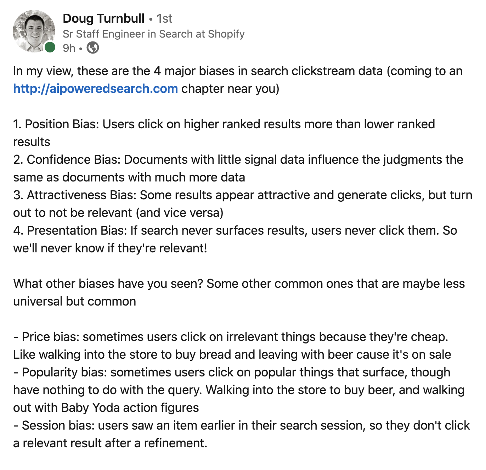

Search and relevancy are often regarded as simply IT problems, implying that if you install the right
software with the right architecture and configuration, your users’ queries will be answered with perfectly
ordered and correct results. Obviously it’s not quite that simple — there is a wide range of factors 
affecting search quality — but in our view, the single most important factor is people.

[Building an Effective Search Team: the key to great search & relevancy](https://opensourceconnections.com/blog/2020/05/14/building-an-effective-search-team-the-key-to-great-search-relevancy/)

1. RECORD SEARCHES
2. TRACK ZERO RESULT SEARCHES
3. ESTABLISH A SEARCH REPORT
4. GET DIRECT USER FEEDBACK
5. BUILD SOLID JUDGMENTS

[5 Right Ways to Measure How Search Is Performing](https://opensourceconnections.com/blog/2020/05/11/5-right-ways-to-measure-search/)

People usually don’t give enough context to search engines for most of their queries. But you can’t blame people for this problem - we’ve been doing this for years because that’s how search engines usually work.

[Understanding BERT and Search Relevance](https://opensourceconnections.com/blog/2019/11/05/understanding-bert-and-search-relevance/)

the top facets for search query should be those associated with the highest demand, not the highest supply.

[Search: Intent, Not Inventory](https://medium.com/@dtunkelang/search-intent-not-inventory-289386f28a21)

[Autocorrect in Google, Amazon and Pinterest and how to write your own one](https://towardsdatascience.com/autocorrect-in-google-amazon-and-pinterest-and-how-to-write-your-own-one-6d23bc927c81)

the important thing is that there is no purely programmatic way which will convert your mistyped “ipone” into “iphone” (at least with decent quality). Mostly there has to be a data set the system is based on.

[Precision at K](https://en.wikipedia.org/wiki/Evaluation_measures_(information_retrieval)#Precision_at_K)

For modern (web-scale) information retrieval, recall is no longer a meaningful metric, as many queries have thousands of relevant documents, and few users will be interested in reading all of them. Precision at k documents (P@k) is still a useful metric (e.g., P@10 or "Precision at 10" corresponds to the number of relevant results among the top 10 documents), but fails to take into account the positions of the relevant documents among the top k. Another shortcoming is that on a query with fewer relevant results than k, even a perfect system will have a score less than 1. It is easier to score manually since only the top k results need to be examined to determine if they are relevant or not.

